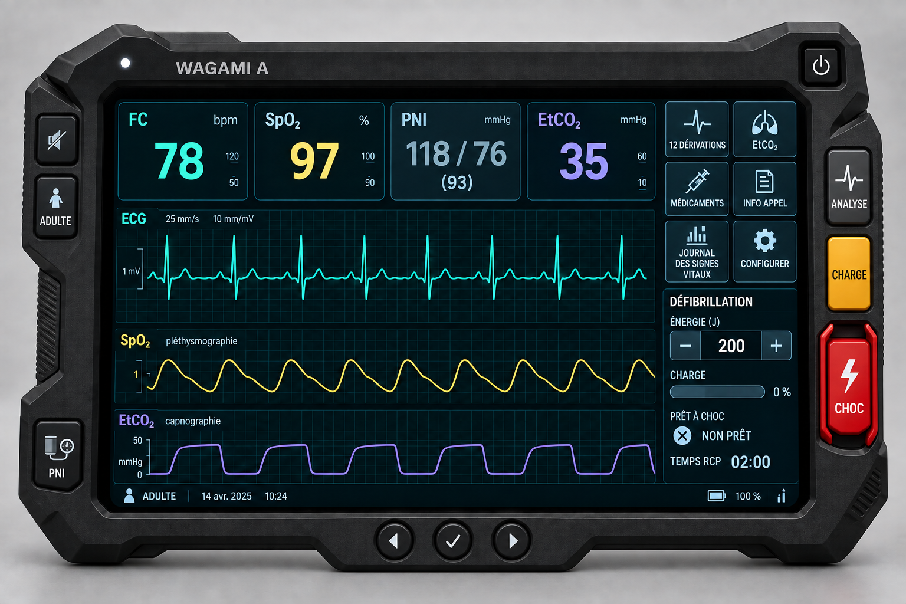

# Wagami A — Precision Graphite Shell Controls v3 Review Candidate

Status: **programmer-approved visual direction for A3.1**, 2026-09-15. The functional control,
navigation, and Vital Log decisions are accepted in `PLAN.md`; this bitmap is not approval of
rendered geometry, clinical behavior, public availability, or intellectual-property clearance.

## What this candidate illustrates

- Isolated upper-right Power; physical right-side ANALYSE → CHARGE → guarded CHOC group centered
  vertically. The previous left Charge and low-right Shock have been replaced.
- Upper-left-side sound mute and Device Patient mode controls; lower-left PNI reading control
  with an original outlined cuff/gauge concept; lower-center circular Left/Enter/Right buttons.
  The upper-left alarm LED remains separate.
- Fixed FC/SpO2/PNI/EtCO2 vital-card order, large ECG and smaller SpO2/EtCO2 traces, six 2×3
  right-screen tasks, and separate defib status. The fifth tile is now `JOURNAL DES SIGNES VITAUX`,
  the fourth is `INFO APPEL`; there is no on-screen Analyze or mute control, and the PNI card is
  a read-only display.
- The front-on graphite shell, crisp outlined cards, screen palette, and waveform emphasis
  carry forward the accepted Precision Graphite v2 direction. This is a revision candidate,
  not a replacement or deletion of v2 or WAGAMI X/Z.

## Generation and provenance

Built-in ImageGen **edited the project's original** `precision-graphite-v2.png` as its sole
image input. The supplied cuff/gauge picture was inspected as a conceptual reference but was
**not an edit input, composited element, traced asset, or file used in the concept**. No online
image asset, ZOLL photo, WAGAMI X/Z image, or third-party logo was used. The project copy is
`precision-graphite-shell-controls-v3.png` (1536×1024); the default generated copy was left
in place. No application bitmap is shipped by this design review.

The final generation prompt requested a realistic front-facing UI/product edit of original
Precision Graphite v2; preserved the faceted matte-charcoal shell, LED, isolated Power, exact
four-card/three-waveform hierarchy, six-tile dock, separate status panel, and French-default
presentation; moved Analyze/Charge/guarded Shock to a centered physical right-shell stack;
added left mute/mode/original outlined PNI icon buttons and three circular lower-shell nav
buttons; changed Events to Call Info and Print/Capture to Journal des signes vitaux; removed
touch Analyze/mute and the PNI-card action; required legible labels; and prohibited ZOLL or
other third-party assets, X/Z blue housing, extra button banks, touchscreen Shock/Charge,
checkerboard background, and invented destinations.

## Review and non-binding details

| Criterion | Candidate observation | Still required before implementation/release |
|---|---|---|
| Clinical readability | Large fixed vital values and central waveforms remain legible at native image size. | Real French/English text, alarm/charge/CPR states, and 1024px rendering. |
| Immediate task access | All six named tasks are visible without a menu. | Click/touch targets, keyboard/shell navigation, and functional destinations. |
| Physical-button clarity | Three right controls differ by shape/color; Shock is red and guarded. | 44px target/separation check, guard feedback, and accidental-touch QA. |
| Landscape fit | The shell is uncropped in a landscape image. | Rendered 1024×768, 1180×820, desktop, and actual landscape iPad checks. |
| X/Z distinction | Graphite asymmetric field-tablet, top vital cards, central traces, and right task dock remain different. The new right physical stack is a **shared broad motif with Wagami Z**, though its order, Power location, screen anatomy, and materials differ. | Side-by-side rendered X/Z review and qualified Canadian IP review; no legal-clearance inference from this image. |

The image's date, battery-style indicators, vital numbers, waveform shapes, and button styling
are illustrative. A's direct `/?dev=3` implementation must still visibly say `PREVIEW`; the
bitmap does not demonstrate this. The Patient mode shell control needs an explicit accessible
`Mode patient` name and current-mode feedback in code, and shell mute needs its actual state.
The LED may be configured Off without muting screen/audio alarms. No v3 pixels should be used
as substitute components or copied over the code-native interface.

The programmer approved this visual candidate as the A3.1 implementation direction. A3.1 must
still pass rendered/interaction tests; X/Z and live A Instructor selection remain unchanged
through this phase.
